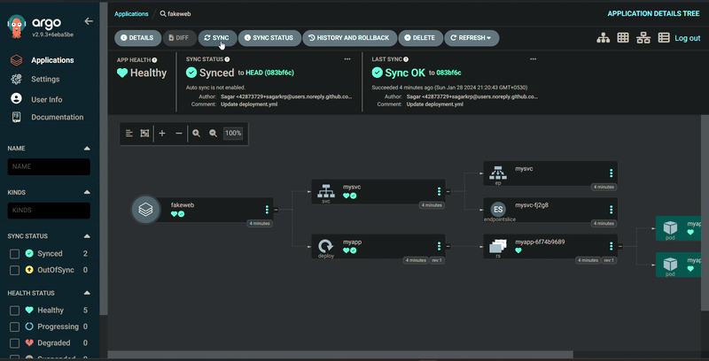

<!-- <h1> Kubenetes Deployment using Argo CD </h1> -->
<h1> GitOps using Argo CD </h1>

<p align="center">
 <a href = "https://sagarcodectrl.medium.com/from-code-to-cluster-argocd-gitops-for-kubernetes-895c734677ef" target ="_blank">

</p>

<h3> <strong> Read the detailed article on: </strong> </h3> <a href = "https://sagarcodectrl.medium.com/from-code-to-cluster-argocd-gitops-for-kubernetes-895c734677ef" target ="_blank"> 
 
<picture>
   <source media="(prefers-color-scheme: dark)" srcset="https://github.com/sagarkrp/sagarkrp/blob/main/images/Medium-white1x.png" width="180px" height="45px">
   <source media="(prefers-color-scheme: light)" srcset="https://raw.githubusercontent.com/sagarkrp/sagarkrp/main/images/Medium-dark.svg" width="180px" height="45px"> 
   
</picture> </a>

---

## Creating docker Image of web app

1. Create a docker file with all necessary steps.
2. Build it with
```
docker build -t registry/repo:tag .
```
3. push to docker hub/any other repo

```
docker push registry/repo:tag
```

## Creating a cluster with Terraform

<details>
<summary>expand ⏬</summary>
1. Cretae the terraform configuration with all the resources type reuired.
In this example here, a resource group and a k8s cluster.

Commands used are:

```
$ tf init - to initiate the provider configuration
```

```
$ tf fmt - does proper alignment
```

```
$ tf validate - checks syntax
```

```
$ tf plan - shows a blueprint of the result if applied
```

```
$ tf apply - cretaes the resources if everything is fine
```


```
$ tf destory - removes all the resources.
```


Note:
* tf is a bash alias for terraform.
* I have used az login with azure cli, so no credentials block in the script.

</details>


## Installing Argo

<details>
<summary>expand ⏬</summary>

* I followed the argo cd documentation

* apply the yaml which craetes a ns.

```
kubectl create namespace argocd
kubectl apply -n argocd -f https://raw.githubusercontent.com/argoproj/argo-cd/stable/manifests/core-install.yaml
```
* Expose argo svc with LB:

```
kubectl patch svc argocd-server -n argocd -p '{"spec": {"type": "LoadBalancer"}}'
```

* forward port to access directly

```
kubectl port-forward svc/argocd-server -n argocd 8080:443
```
* Access argo web Ui with loadblaner ip


* get argocd initial pw

```
argocd admin initial-password -n argocd
```

Create app with url pointinv to the repo and the deployment yaml.

Upon apply, we'll see pods getting creted. 2 replicas for now.


The running web app accesible with LB ip


Note: There are 2 footer. the first is "icons"

</details>

## Crrate VM for Jenkins operation

* VM created for using Jenkins to build, push docker image.

* apply main.tf under vm dir.


## Ansible for docker and jenkins installation

<details>
<summary>expand ⏬</summary>

* Using ansible roles to install jenkins and docker.

### playbook: install_jenkins.yml

* Proceed with usual jenkins setup after the installation


### playbook : docker_install.yml

this palybook installs docker and adds the jenkins user to the docker group (to run docker cmd without sudo in jenkins)


</details>

## Update replicas in repo and sync the argo app

<details>
<summary>expand ⏬</summary>

* The initial replica count was 2, now updated to 3


Sync the argo app.



## update web app code

Jenkins has been setup to build and push the docker image by tagging then with the build number.

It also updates the tag in the deployment.yml and commits to the repo.


## Code update on the web app to update the deployment.

I have removed the favicons footer as seen on the previous app web page.

After the build, push and sync.


The favicons footer has been removed for our deployed app.

</details>

## Delete Resources

To destroy the resources use tf destroy.


